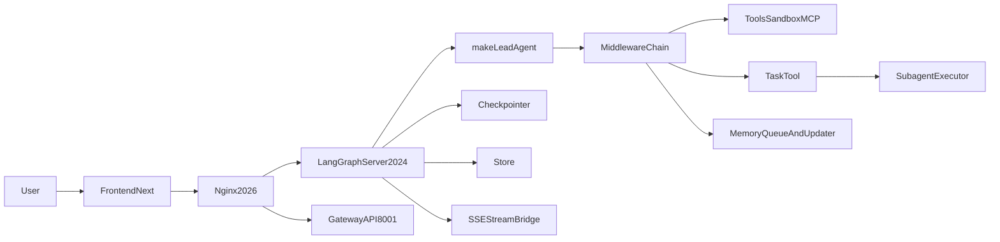

# DeerFlow 面试学习手册

## 一句话定位

DeerFlow 是一个面向生产场景的 Agent 全栈项目：前端用 `Next.js` 提供交互层，后端用 `FastAPI + LangGraph` 提供 Agent runtime、工具系统、subagent、多层 memory、sandbox 和 guardrails。

## 仓库结构

- `backend/`: 面试最重要的部分。Agent runtime、gateway、memory、subagent、middleware、sandbox、guardrails 都在这里。
- `frontend/`: Web 聊天界面与配置入口，负责消费 SSE 和调用后端 API。
- `docker/`: 生产化部署细节，尤其是 `nginx` 如何统一代理入口。
- `skills/`: SKILL.md 资产，体现能力通过 prompt 注入而非硬编码。
- `scripts/`: 启动与部署编排，比如 `serve.sh` 会拉起多个进程。

## 系统图

## 请求主链路

1. 用户从前端发起请求，统一经过 `Nginx`。
2. Agent 对话流量进入 LangGraph server；其他配置类 API 进入 Gateway。
3. Gateway 在 `backend/app/gateway/services.py` 里把 `thread_id`、`assistant_id`、`context/configurable` 组装成运行配置。
4. `backend/packages/harness/deerflow/runtime/runs/worker.py` 为本次 run 手动注入 `Runtime(context={"thread_id": ...}, store=store)`。
5. `backend/packages/harness/deerflow/agents/lead_agent/agent.py` 调用 `make_lead_agent()` 构造 lead agent，包括 model、tools、prompt、middleware 和 `ThreadState`。
6. Agent 运行期间可以直接调用工具，也可以通过 `task` 工具把子任务分发给 subagent。
7. 输出通过 `StreamBridge + SSE` 流式返回给前端。

## 面试核心主线

### 1. Agent 上下文

这个项目的上下文不是一个单独的 message history，而是四层叠加：

- 配置上下文：由 `services.py` 组装，包含 `model_name`、`subagent_enabled`、`is_plan_mode` 等。
- 运行时上下文：由 `worker.py` 注入 `Runtime(context/store)`，让 middleware 和 tool 能读到 `thread_id` 这类线程级信息。
- 状态上下文：由 `ThreadState` 管理，除了 `messages`，还包含 `sandbox`、`thread_data`、`artifacts`、`todos`、`viewed_images` 等运行态字段。
- 提示词上下文：由 `lead_agent/prompt.py` 动态拼装 memory、skills、subagent 规则、citation 规范、clarification first 规则。

面试表达建议：

- 不要只说“上下文是聊天历史”，而要说“DeerFlow 把上下文拆成配置、运行时、状态、提示词四层”。
- 强调 prompt 只是最后一层，不是唯一载体。

### 2. 多 Agent 编排

DeerFlow 采用的不是固定 supervisor graph，而是“单 lead agent + 动态 subagent 委派”。

- 主 agent 通过 `task` 工具发起委派。
- `task_tool.py` 负责把委派请求转换成 subagent 执行任务，并把执行过程包装成对主 agent 友好的 tool result。
- `subagents/executor.py` 负责真正的后台执行、超时、取消、轮询和结果归并。
- subagent 默认继承父级的 `sandbox_state`、`thread_data`、`thread_id`，但不会再开放 `task` 工具，避免递归套娃。
- `SubagentLimitMiddleware` 在系统层强行截断超出上限的并发 `task` 调用，降低纯 prompt 约束失效带来的风险。

面试表达建议：

- 这是一种“动态编排”。
- 优点是灵活、扩展快、角色不固化。
- 缺点是可预测性和可控性弱于静态 DAG，更依赖 prompt 和 middleware。

### 3. Memory

这个项目至少有三层 memory，要分清楚：

- 短期状态：`ThreadState + messages + checkpointer`，解决当前线程内“记住了什么”。
- 线程元数据：`store`，解决“有哪些 thread、标题是什么、元信息是什么”。
- 长期记忆：`MemoryMiddleware -> queue -> MemoryUpdater -> JSON storage -> prompt injection`，解决跨会话的用户事实保留。

它的 memory hygiene 很适合面试展开：

- 不把 `ToolMessage`、带有 `tool_calls` 的中间态 AI message 直接写入长期记忆。
- 不把上传文件块、临时路径、会话内上传事件直接沉淀成长期事实。
- 能识别用户纠错信号和正向 reinforcement，把“哪里错了”和“什么是用户喜欢的行为”提炼出来。

边界也要会讲：

- 长期 memory 更新依赖 LLM 输出 JSON。
- JSON 解析失败时会跳过这次更新，所以系统稳定，但不是强一致。

### 4. 稳定性

DeerFlow 的稳定性设计主要体现在 middleware 和运行时边界上：

- `LLMErrorHandlingMiddleware`: 把 LLM 故障分成 quota、auth、busy、transient，再做重试和降级。
- `ToolErrorHandlingMiddleware`: 把工具异常变成 `ToolMessage(status="error")`，而不是直接把整条链路打崩。
- `LoopDetectionMiddleware`: 检测重复工具调用，必要时强制停止工具循环并要求 agent 直接给文字结论。
- `DanglingToolCallMiddleware`: 修复中断或取消后消息序列缺失的问题。
- `SubagentExecutor`: 提供 timeout、cancel、后台任务清理、轮询兜底，避免 subagent 挂死。
- `SSE/StreamBridge`: 让长任务能持续返回事件，避免用户只能傻等。

面试表达建议：

- 可以概括为“异常隔离 + 有损降级 + 中断恢复 + 上限控制”。

### 5. 幻觉控制

这里要辩证地讲，不要说过头。

DeerFlow 有以下抑制幻觉手段：

- clarification first：不清楚先问，不允许带着猜测直接执行。
- tool-first grounding：尽量通过 `read_file/web_search/web_fetch` 等工具取证。
- citation 约束：外部检索结果要带引用。
- memory correction：用户纠错可沉淀到长期记忆，减少同类错误复发。
- guardrails：限制能调用什么工具、能执行什么命令。

但它没有完全解决事实核验：

- guardrails 解决的是行为安全，不是事实真实性。
- prompt 和 citation 主要靠流程约束，不是 claim verifier。
- 目前没有统一的 answer-to-evidence 对齐器去检查最终回答是否真的被证据支持。

面试里可以主动给出改进方向：

- 引入 claim extraction + retrieval verification。
- 对高风险回答增加 evidence alignment check。
- 在最终输出里区分“检索支撑结论”和“模型推理结论”，并显式标注置信度。

## 重点文件阅读顺序

1. `backend/docs/ARCHITECTURE.md`
2. `backend/README.md`
3. `backend/app/gateway/services.py`
4. `backend/packages/harness/deerflow/runtime/runs/worker.py`
5. `backend/packages/harness/deerflow/agents/lead_agent/agent.py`
6. `backend/packages/harness/deerflow/agents/lead_agent/prompt.py`
7. `backend/packages/harness/deerflow/tools/builtins/task_tool.py`
8. `backend/packages/harness/deerflow/subagents/executor.py`
9. `backend/packages/harness/deerflow/agents/middlewares/memory_middleware.py`
10. `backend/packages/harness/deerflow/agents/memory/updater.py`
11. `backend/docs/GUARDRAILS.md`
12. `backend/packages/harness/deerflow/agents/middlewares/llm_error_handling_middleware.py`
13. `backend/packages/harness/deerflow/agents/middlewares/tool_error_handling_middleware.py`
14. `backend/packages/harness/deerflow/agents/middlewares/loop_detection_middleware.py`
15. `backend/packages/harness/deerflow/agents/middlewares/subagent_limit_middleware.py`

## 10 天学习路线

### 第 1-2 天

- 只看 `ARCHITECTURE.md`、`backend/README.md`、`scripts/serve.sh`。
- 目标是能在 3 分钟内讲清系统组件、请求流和运行入口。

### 第 3-4 天

- 串读 `services.py -> worker.py -> agent.py -> thread_state.py -> prompt.py`。
- 目标是把“上下文如何进入 agent”讲清楚。

### 第 5-6 天

- 串读 `task_tool.py -> subagents/executor.py -> subagent_limit_middleware.py`。
- 目标是能说清动态编排和并发控制。

### 第 7 天

- 串读 `memory_middleware.py -> memory/updater.py` 及相关 API。
- 目标是能解释短期状态、线程存储、长期记忆的边界。

### 第 8 天

- 串读 LLM retry、tool fallback、loop detection、interrupt、timeout。
- 目标是形成一个完整的稳定性心智模型。

### 第 9 天

- 专门练习幻觉控制：clarification、citation、guardrails、memory correction。
- 目标是既能讲优点，也能讲当前边界和改进方案。

### 第 10 天

- 口述练习 5 次：
- `项目架构概览`
- `agent context`
- `多 agent 编排`
- `memory`
- `稳定性与幻觉控制`

## 你最后要具备的能力

- 用 3 分钟讲清 DeerFlow 的整体架构。
- 用 2 分钟讲清上下文链路和 ThreadState 设计。
- 用 2 分钟讲清动态 subagent 编排的优缺点。
- 用 2 分钟讲清 memory 三层结构和 hygiene。
- 用 2 分钟讲清稳定性与幻觉控制，并给出 2-3 个工程改进方向。

